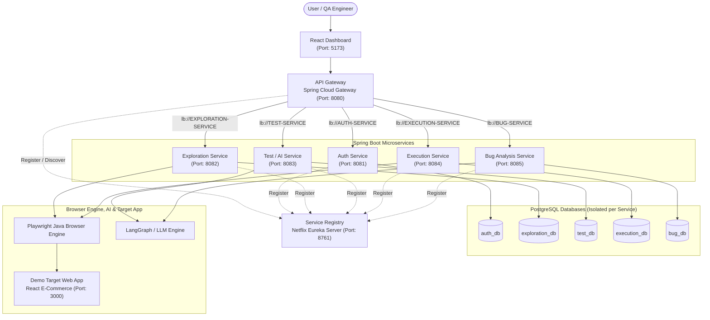

# AI Test Agent: Autonomous AI-Based Web Application Testing and Intelligent Bug Reporting

## 1. Project Description

**AI Test Agent** is an autonomous AI-powered web application testing and intelligent bug reporting platform developed as a university Minor Project.

The platform explores a target web application, uses an agentic AI workflow to determine **what** functional workflows and edge cases should be tested, executes those test cases deterministically in a real browser via **Playwright**, and analyzes failures using an **LLM** to produce structured, actionable bug reports in a React dashboard.

### Agentic AI Workflow
The system operates around a structured closed-loop cognitive cycle:
```text
OBSERVE → REASON → PLAN → ACT → OBSERVE RESULT → ANALYZE
```

### Core Architectural Principle (Strict Separation of Concerns)
- **LLM (Brain / Planner & Analyzer)**: Understands discovered page structure, identifies user workflows, generates structured JSON test plans, analyzes test failures, and produces human-readable bug reports. **The LLM never directly executes arbitrary browser or system code.**
- **Spring Boot Microservices (Orchestrator & Control Plane)**: Handles authentication, API routing, service discovery, validation, database persistence, and deterministic execution orchestration.
- **Playwright (Deterministic Actuator)**: Performs actual browser interactions (`navigate`, `click`, `fill`, `wait`, `assert`, `screenshot`) strictly from validated, structured commands.

---

## 2. System Architecture

### End-to-End Flow
```text
User
 → React Dashboard
 → API Gateway
 → Exploration Service
 → Test/AI Service
 → Execution Service
 → Playwright
 → Target Web Application
 → Execution Result
 → Bug Analysis Service
 → LLM
 → Bug Report
 → React Dashboard
```

### Architecture Diagram



---

## 3. Planned AI Architecture

```text
Exploration Service
       ↓
Structured Page Information
       ↓
Test / AI Service
       ↓
LangGraph Agent
       ↓
LLM
       ↓
Structured Test Cases (JSON)
       ↓
Execution Service
       ↓
Playwright Browser Runner
       ↓
Execution Result
       ↓
Bug Analysis Service
       ↓
LangGraph / LLM
       ↓
Structured Bug Report
```

- **LangGraph**: Orchestrates the stateful, multi-step agent workflow (state transitions across observation, test planning, validation, and failure diagnosis).
- **LangChain**: Used as a supporting LLM integration library for prompt templates, model adapters, and structured output parsing.

---

## 4. Microservices & Applications Overview

| Component | Directory | Port | Database | Responsibilities |
| :--- | :--- | :--- | :--- | :--- |
| **Service Registry** | `service-registry/` | `8761` | None | Netflix Eureka Server for service registration and discovery. |
| **API Gateway** | `api-gateway/` | `8080` | None | Single entry point for the React Frontend, request routing (`lb://`), CORS configuration, and future JWT validation. |
| **Auth Service** | `auth-service/` | `8081` | `auth_db` | User registration, login, BCrypt password hashing, JWT generation, and role management (`USER`, `ADMIN`). |
| **Exploration Service** | `exploration-service/` | `8082` | `exploration_db` | Launches Playwright to crawl a target URL, extract links, buttons, forms, inputs, and build structured page models. |
| **Test / AI Service** | `test-service/` | `8083` | `test_db` | Interfaces with the AI Agent (LangGraph + LLM) to generate structured test cases from explored page models. |
| **Execution Service** | `execution-service/` | `8084` | `execution_db` | Executes generated test cases deterministically against the target web app using Playwright (`navigate`, `click`, `fill`, `wait`, `assert`, `screenshot`). |
| **Bug Analysis Service** | `bug-service/` | `8085` | `bug_db` | Analyzes failed test executions via LangGraph/LLM to generate structured bug reports with severity and root-cause hints. |
| **Frontend Dashboard** | `frontend/` | `5173` | None | React + Vite dashboard for authentication, triggering explorations/tests, viewing execution status, and inspecting bug reports. |
| **Demo Target App** | `demo-target-app/` | `3000` | None | Standalone React e-commerce web application (`BUG_MODE` configurable) used as the test target for the AI Test Agent. |

> **Database Isolation Rule**: Every backend microservice owns its dedicated PostgreSQL database (`auth_db`, `exploration_db`, `test_db`, `execution_db`, `bug_db`). **No service may directly access another service's database.** All inter-service communication happens exclusively over REST APIs.

---

## 5. Tech Stack

- **Frontend**: React 18, Vite, JavaScript (ES6+), React Router DOM, Axios, HTML5, CSS3
- **Backend**: Java 21, Spring Boot 3.x, Spring Cloud Gateway, Spring Cloud Netflix Eureka, Spring Security, Spring Data JPA, Spring Boot Actuator
- **Database**: PostgreSQL (with H2 support for isolated testing)
- **Security**: JWT (JSON Web Tokens), BCrypt Password Hashing
- **Browser Automation**: Playwright for Java
- **AI / Agentic Layer (Planned)**: LLM APIs, LangGraph (stateful agent orchestration), LangChain (LLM integration utilities)
- **Testing**: JUnit 5, Mockito, Spring Boot Test
- **Build & Version Control**: Apache Maven, npm, Git, GitHub

---

## 6. Service Ports Summary

| Service / Application | Port | Base URL / Health Check |
| :--- | :--- | :--- |
| **Service Registry (Eureka)** | `8761` | `http://localhost:8761` (`http://localhost:8761/actuator/health`) |
| **API Gateway** | `8080` | `http://localhost:8080` (`http://localhost:8080/actuator/health`) |
| **Auth Service** | `8081` | `http://localhost:8081` (`http://localhost:8081/actuator/health`) |
| **Exploration Service** | `8082` | `http://localhost:8082` (`http://localhost:8082/actuator/health`) |
| **Test Service** | `8083` | `http://localhost:8083` (`http://localhost:8083/actuator/health`) |
| **Execution Service** | `8084` | `http://localhost:8084` (`http://localhost:8084/actuator/health`) |
| **Bug Analysis Service** | `8085` | `http://localhost:8085` (`http://localhost:8085/actuator/health`) |
| **React Frontend Dashboard** | `5173` | `http://localhost:5173` |
| **Demo Target Web App** | `3000` | `http://localhost:3000` |

---

## 7. How to Run the Project

### Prerequisites
- **Java 21** (`java -version`)
- **Apache Maven 3.9+** (`mvn -version`)
- **Node.js 18+ & npm** (`node -v`, `npm -v`)
- **PostgreSQL 15+** running on `localhost:5432`

### Step 1: Prepare Environment & PostgreSQL Databases
1. Copy `.env.example` to `.env` and fill in your local credentials:
   ```bash
   cp .env.example .env
   ```
2. Create the five isolated PostgreSQL databases in `psql` or pgAdmin:
   ```sql
   CREATE DATABASE auth_db;
   CREATE DATABASE exploration_db;
   CREATE DATABASE test_db;
   CREATE DATABASE execution_db;
   CREATE DATABASE bug_db;
   ```
   *(Tip: For quick local testing without PostgreSQL, each data-backed service also supports an in-memory H2 profile via `-Dspring-boot.run.profiles=h2`.)*

### Step 2: Start Eureka Service Registry (Must Start First)
```bash
cd service-registry
mvn spring-boot:run
```
Verify Eureka Dashboard at: `http://localhost:8761`

### Step 3: Start Core Backend Microservices
Open separate terminals for each microservice:

**Auth Service (Port 8081):**
```bash
cd auth-service
mvn spring-boot:run
```

**Exploration Service (Port 8082):**
```bash
cd exploration-service
mvn spring-boot:run
```

**Test Service (Port 8083):**
```bash
cd test-service
mvn spring-boot:run
```

**Execution Service (Port 8084):**
```bash
cd execution-service
mvn spring-boot:run
```

**Bug Analysis Service (Port 8085):**
```bash
cd bug-service
mvn spring-boot:run
```

### Step 4: Start API Gateway (Port 8080)
```bash
cd api-gateway
mvn spring-boot:run
```

### Step 5: Start Frontend Dashboard (Port 5173)
```bash
cd frontend
npm install
npm run dev
```
Open `http://localhost:5173`

### Step 6: Start Demo Target Application (Port 3000)
```bash
cd demo-target-app
npm install
npm run dev
```
Open `http://localhost:3000`

---

## 8. Two-Developer Git Collaboration Workflow

### Branch Structure
```text
main
 │
 ├── develop
 │
 ├── feature/auth-service
 ├── feature/exploration-service
 ├── feature/test-service
 ├── feature/execution-service
 ├── feature/bug-service
 ├── feature/frontend
 └── feature/demo-target
```

### Collaboration Rules
1. **Never commit directly to `main`.** `main` is reserved for stable, verified milestones.
2. `develop` is the integration branch where completed features are merged via Pull Requests.
3. Both developers clone the repository and switch to `develop`:
   ```bash
   git clone <repository-url>
   cd ai-test-agent
   git checkout develop
   ```
4. Create a dedicated feature branch before starting work:
   ```bash
   git checkout -b feature/auth-service
   ```
5. Stage, commit with conventional commit messages, and push the feature branch:
   ```bash
   git add .
   git commit -m "feat: implement auth service base"
   git push origin feature/auth-service
   ```
6. Open a **Pull Request** on GitHub targeting `develop` and have the other developer review before merging.

### Suggested Initial Team Division
- **Developer 1**:
  - `service-registry/`
  - `api-gateway/`
  - `auth-service/`
  - `exploration-service/`
  - Related documentation
- **Developer 2**:
  - `test-service/`
  - `execution-service/`
  - `bug-service/`
  - `frontend/`
  - `demo-target-app/`
  - Related documentation

---

## 9. Additional Documentation

Detailed project documentation is available in the [`docs/`](./docs/) directory:
- [System Architecture & AI Workflow](./docs/architecture.md)
- [REST API Overview](./docs/api-overview.md)
- [Development & Git Workflow](./docs/development-workflow.md)
- [Project Roadmap](./docs/project-roadmap.md)
